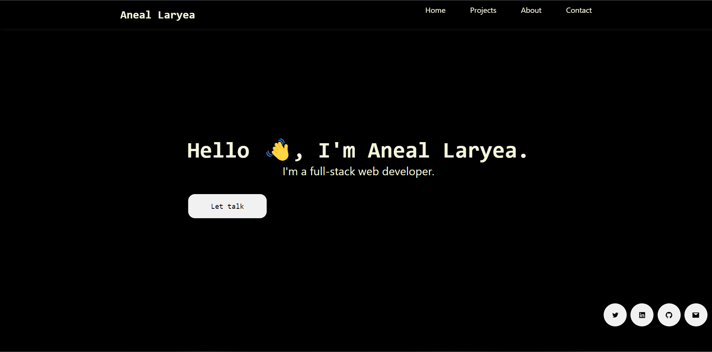

# Aneal Laryea

Hi there! My name is Aneal Laryea and I am a full-stack developer with a passion for building Mobile and Web applications. I am skilled in HTML, CSS, JavaScript, React, Ruby, Ruby on Rails, MySQL, PostgreSQL  and have a strong background in Marketing and Business Administration.

## live demo
[Live Link](https://aneallaryea.netlify.app/)
## Overview

## Getting Started

- Clone this repository by running `https://github.com/aneallaryea100/aneallaryea.git` in your CLI.
- Type `cd aneallaryea`
- Type `code .`
- Run `npm install`
- Run `npm start`
- Open Browser `http://localhost:3000/`

## AUTHOR
👤 Aneal Laryea
* Github: [@aneallaryea](https://github.com/aneallaryea100)
* LinkedIn: [@aneallaryea](https://www.linkedin.com/in/niianeal/)
* Twitter: [@aneallaryea](https://twitter.com/AnealLaryea)
## 🤝 Contributing

Contributions, issues, and feature requests are welcome!
Feel free to check the [issues page](https://github.com/aneallaryea100/aneallaryea/issues).

## Show your support

Give a ⭐️ if you like this project!

## 📝 License

This project is [MIT](./MIT.md) licensed.